# XUBU / collected writing

Fourteen articles. Preserved words and images. Research-folder paths in article bodies are masked in these public copies.

These are historical authored sources; their claims are not automatically riddle canon. [Archive details and limits](README.md).

## For Those Who Stayed Long Enough to Hear It

[Read](articles/a8d8da797a43/article.txt) · [Screened HTML](articles/a8d8da797a43/original.html) · [Offline edition](articles/a8d8da797a43/offline.html) · [Verification and proof files](articles/a8d8da797a43/VERIFICATION.md)

## Pandora’s Jar

<a href="articles/47677e4ed7cb/article.txt">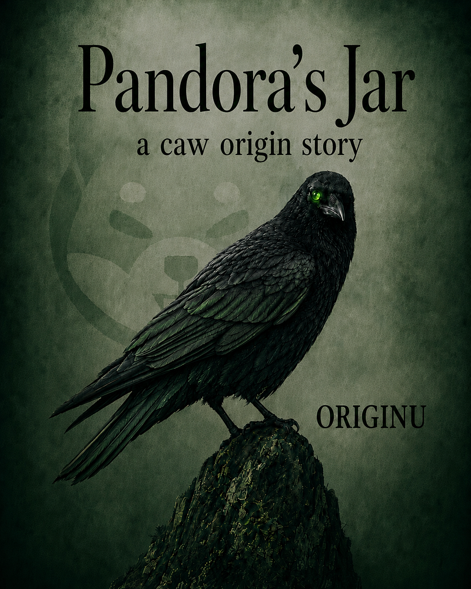</a>

[Read](articles/47677e4ed7cb/article.txt) · [Screened HTML](articles/47677e4ed7cb/original.html) · [Offline edition](articles/47677e4ed7cb/offline.html)

## Pandora’s Urn

<a href="articles/004c932ccd93/article.txt">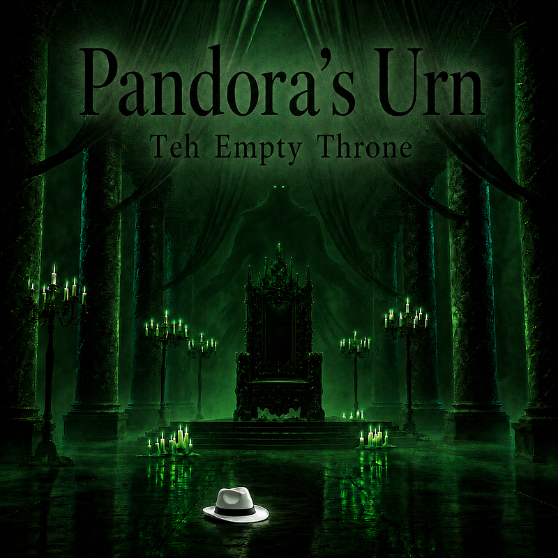</a>

[Read](articles/004c932ccd93/article.txt) · [Screened HTML](articles/004c932ccd93/original.html) · [Offline edition](articles/004c932ccd93/offline.html)

## CAW PUBLIC PEER REVIEW

<a href="articles/d783b6da1021/article.txt">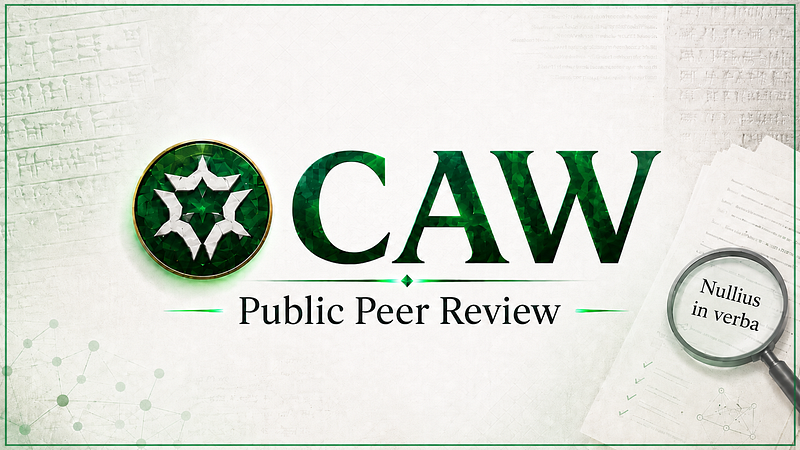</a>

[Read](articles/d783b6da1021/article.txt) · [Screened HTML](articles/d783b6da1021/original.html) · [Offline edition](articles/d783b6da1021/offline.html)

## The Architect of a False Market

<a href="articles/1f36f43c85c6/article.txt">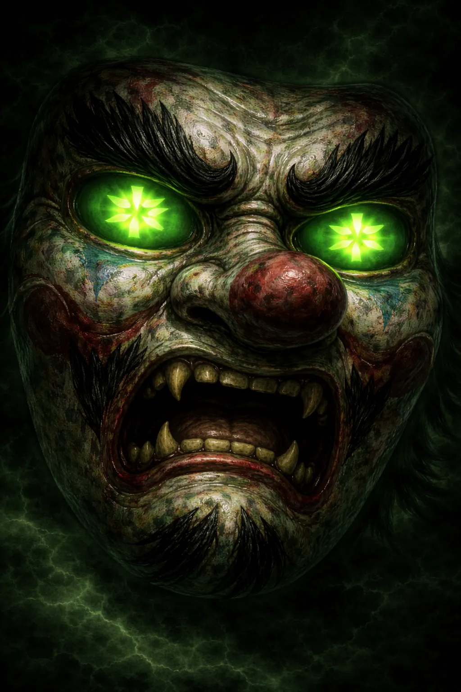</a>

[Read](articles/1f36f43c85c6/article.txt) · [Screened HTML](articles/1f36f43c85c6/original.html) · [Offline edition](articles/1f36f43c85c6/offline.html)

## is caw a scam?

[Read](articles/495253b7a0b4/article.txt) · [Screened HTML](articles/495253b7a0b4/original.html) · [Offline edition](articles/495253b7a0b4/offline.html)

## OSAK.CAWMMUNITY/kachoperro

<a href="articles/efd40f50d1bf/article.txt">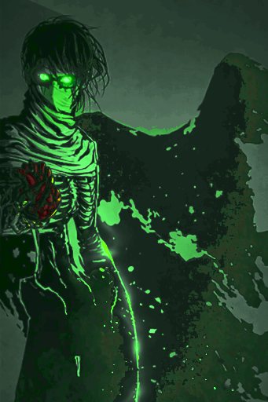</a>

[Read](articles/efd40f50d1bf/article.txt) · [Screened HTML](articles/efd40f50d1bf/original.html) · [Offline edition](articles/efd40f50d1bf/offline.html)

## OSAK.COMMUNITY/kachoperro

<a href="articles/72f812b6c0f9/article.txt">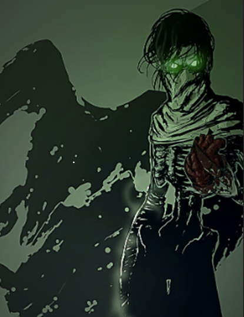</a>

[Read](articles/72f812b6c0f9/article.txt) · [Screened HTML](articles/72f812b6c0f9/original.html) · [Offline edition](articles/72f812b6c0f9/offline.html)

## va gru chEfhvg bs gehgu…

<a href="articles/610efb781ca5/article.txt">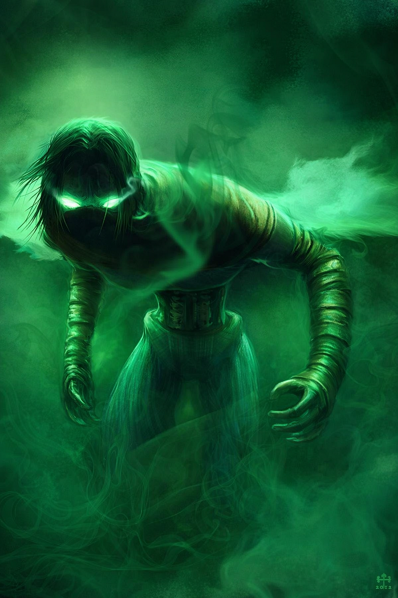</a>

[Read](articles/610efb781ca5/article.txt) · [Screened HTML](articles/610efb781ca5/original.html) · [Offline edition](articles/610efb781ca5/offline.html)

## @ShytoshiKusama

<a href="articles/e0c54dd124d0/article.txt">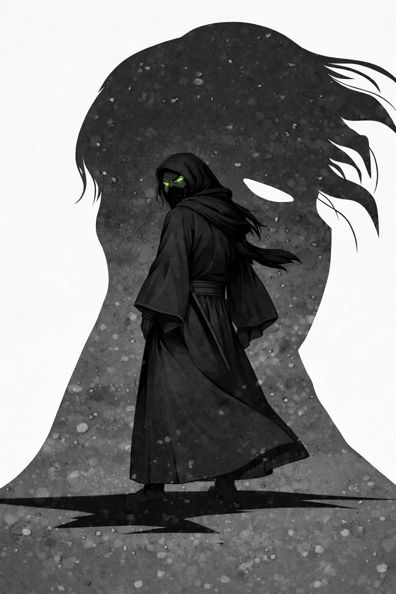</a>

[Read](articles/e0c54dd124d0/article.txt) · [Screened HTML](articles/e0c54dd124d0/original.html) · [Offline edition](articles/e0c54dd124d0/offline.html)

## THE INVISIBLE BUILDER

<a href="articles/bbf12ce928fe/article.txt">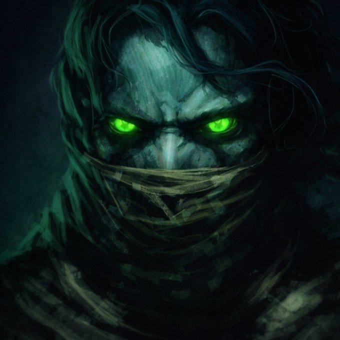</a>

[Read](articles/bbf12ce928fe/article.txt) · [Screened HTML](articles/bbf12ce928fe/original.html) · [Offline edition](articles/bbf12ce928fe/offline.html)

## Love Like Family

<a href="articles/cde302fb7eab/article.txt">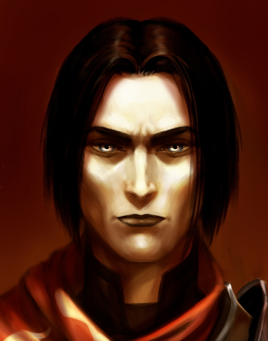</a>

[Read](articles/cde302fb7eab/article.txt) · [Screened HTML](articles/cde302fb7eab/original.html) · [Offline edition](articles/cde302fb7eab/offline.html)

## “Luke, I am your father.”

<a href="articles/9620860bf92a/article.txt">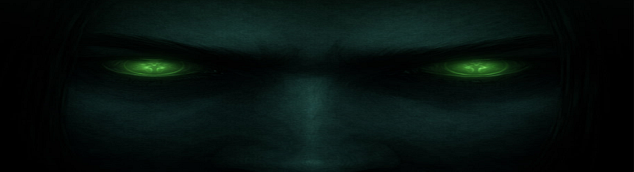</a>

[Read](articles/9620860bf92a/article.txt) · [Screened HTML](articles/9620860bf92a/original.html) · [Offline edition](articles/9620860bf92a/offline.html)

## An autopsy of cawincidence,

[Read](articles/45e251cb90ec/article.txt) · [Screened HTML](articles/45e251cb90ec/original.html) · [Offline edition](articles/45e251cb90ec/offline.html)

